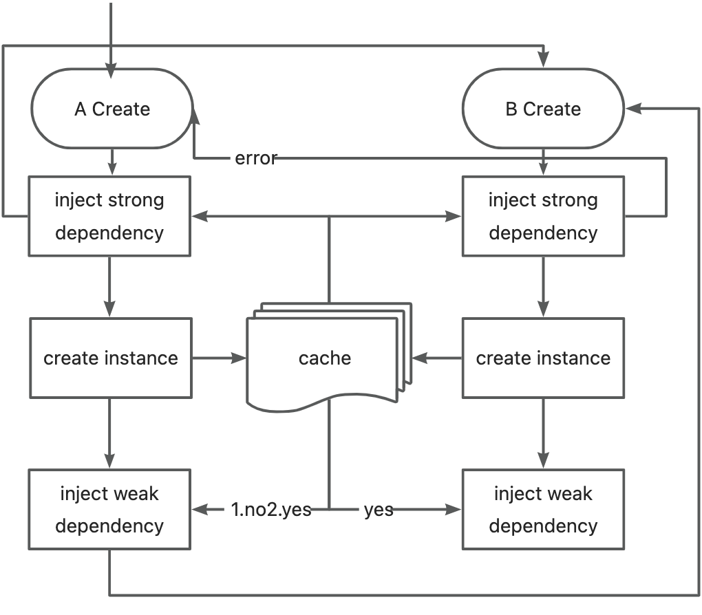

# IoC Design
## Features
Initialize all beans on startup (ApplicationContext)  
only support annotation config  
scan class by package name  
only support singleton class  
bean factory only support @Bean  
suppport customize bean (BeanPostProcessor)  
dependency injection support constructor、setter、filed three ways   
only one container
## Overview

## Property inquiry 
1. key  
2. ${key}  (use in @Value)  
3. ${key:defaultValue} (supprt recursion)
## Bean control
### Beandef Create
```
@ComponentScan
@Import(A.class)
class Application(){}
```
1. get package name of @ComponentScan class 
2. scan all classes names in the package and imported classes
3. create beanDefs of @Component (and @Configuration with @Bean method )  
<font color=red> recursion find @Component </font> because some annnotations such as @Configuration has @Component
### Bean instance create
1. create factory beans  
    1.1 create bean instance  
    1.2 inject weak dependency
2. create normal beans  
    2.1 inject strong dependency  
    2.2 create bean instance  
    2.3 convert customize proxy bean    
    2.4 inject weak dependency
3. init all beans

## dependency injection
### Strong dependence
A bean instance  creatation depends B dependency injection  
eg.  A strong depends B ->  A(B b)   
constructer  parameter  dependency injection
````
@Component
public class A {
    B b;
    public A(@Autowired B b) {
        this.B= b;
    }
}
````
factory method  parameter   dependency injection
````
@Configuration
public class XConfig {
    @Bean
    A a(@Autowired B b) {
        return new A(b);
    }
}
````
<font color=red>circular dependency  Unsolvable</font>
A(B b)  B(A a)
### weak dependence
create A bean instance first then B dependency injection through reflection  
eg.  A weak depends B  
setter method    dependency injection
````
@Component
public class A {
    B b;
    @Autowired 
    public setB(B b) {
        this.B= b;
    }
}
````
field   dependency injection
````
@Component
public class A {
    @Autowired 
    B b;
}
````
<font color=red>circular dependency  solvable</font>A()  B() a.b=b b.a=a  
### circular dependency solution

bean creation includes 3 steps
1. strong dependency injection
detect circular dependency through a HashSet with BeanDef names and report error .
2. create instance
set instance(not with weak dependency) int the BeanDefs cache
3.  weak dependency injection
get injected instance from Beandefs cache


## FAQ
### singleton Bean vs singleton Class
create one bean per bean identifier in a container and create multiple singleton beans from the same class   
vs  
create only one instance from a class


