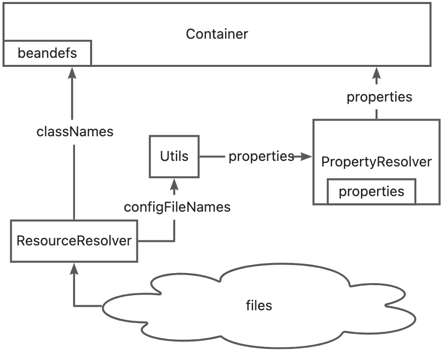

# IoC Design
## Features
Initialize all beans on startup (ApplicationContext)  
only support annotation config  
scan class by package name  
only support singleton class  
bean factory only support @Bean  
suppport customize bean (BeanPostProcessor)  
dependency injection support constructor、setter、filed three ways   
only one container
## Overview

## Property inquiry 
1. key  
2. ${key}  (use in @Value)  
3. ${key:defaultValue} (supprt recursion)
## Bean control
### Beandef Create
```
@ComponentScan
@Import(A.class)
class Application(){}
```
1. get package name of @ComponentScan class 
2. scan all classes names in the package and imported classes
3. create beanDefs of @Component (and @Configuration with @Bean method )  
<font color=red> recursion find @Component </font> because some annnotations such as @Configuration has @Component
### Bean instance create
1. create factory beans
2. create normal beans(inject strong dependency)
3. convert customize proxy bean 
4. inject weak dependency
## dependency injection
### Strong dependence
A bean instance  creatation depends B dependency injection  
eg.  A strong depends B ->  A(B b)   
constructer  parameter  dependency injection
````
@Component
public class A {
    B b;
    public A(@Autowired B b) {
        this.B= b;
    }
}
````
factory method  parameter   dependency injection
````
@Configuration
public class XConfig {
    @Bean
    A a(@Autowired B b) {
        return new A(b);
    }
}
````
<font color=red>circular dependency  Unsolvable</font>
A(B b)  B(A a)
### weak dependence
create A bean instance first then B dependency injection through reflection  
eg.  A weak depends B  
setter method    dependency injection
````
@Component
public class A {
    B b;
    @Autowired 
    public setB(B b) {
        this.B= b;
    }
}
````
field   dependency injection
````
@Component
public class A {
    @Autowired 
    B b;
}
````
<font color=red>circular dependency  solvable</font>
A()  B() a.b=b b.a=a

@Bean创建的不是单例


